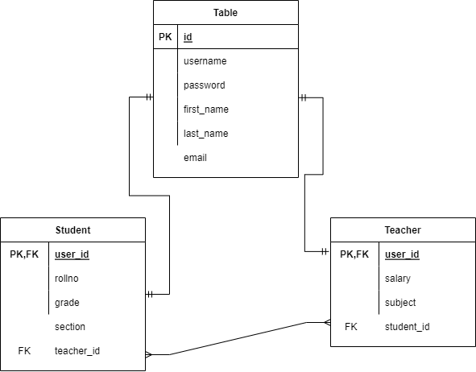

# school-rest-api
## Credicxo Internship Assignment

## Overview
The API consists of a sign up endpoint through which a user can register as a
student or a teacher. A user can also change the password using the reset
password endpoint. After logging in, the user takes the following roles:

- Student
  - Can only view his/her details using the students retrieve endpoint.

- Teacher
  - Can add and view students using the students create and list endpoint.

- Super User
  - Can add and view teachers using the teachers create and list endpoint.
  - Can add and view students using the students create and list endpoint.

*Note: To register as a Super User one has to create a super user using the command
in step 7 or using the Django Admin panel*

## Installation Instructions
1. Create virtual Environment: `virtualenv ./env`
2. Activate virtual Environment: `env\Scripts\activate`
3. Install required packages using pip: `pip install -r requirements.txt`
4. Configure Database Settings in setting.py file (Modify DATABASES dictionary)
5. Create local migrations files: `python manage.py makemigrations`
6. Migrate to Database: `python manage.py migrate`
7. Create Super User: `python manage.py createsuperuser`

## Schema Diagram

